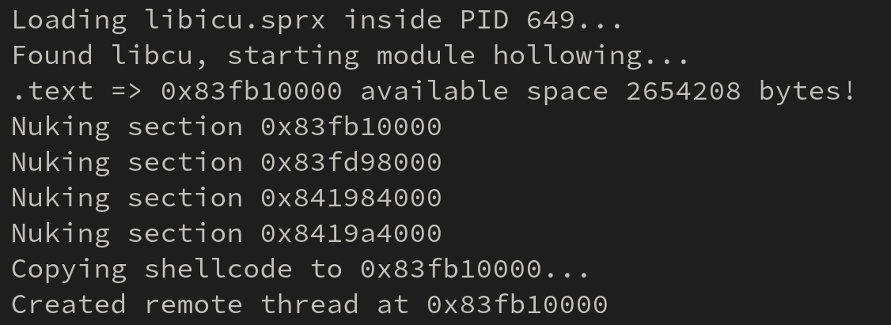
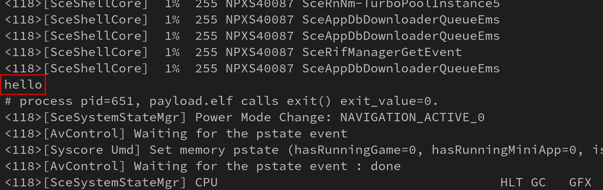

# Nines (9S) - POC

This project is the result of an experiment in code injection techniques on the PlayStation 5. Since it's not possible to allocate executable memory using calls like `mmap`, and other techniques, such as abusing the `JIT` memory area to write shellcode, are not available to every process, alternative methods are explored.

## Idea

The concept is simple. By using Kernel R/W primitives in the kernel `.data` section, one can elevate process-specific privileges, such as the AuthorityID, which allows debugging of other processes via `ptrace`. 

With this power, it is possible to invoke remote functions to load a library into the process, which provides a suitable space for executable memory.

Once the library is loaded, it’s possible to remove all existing data and either write shellcode or load an ELF file into the allocated memory. This technique is similar to the Windows Process Hollowing method.

To trigger the shellcode, we remotely resolve and call the `pthread_create` function to initialize the shellcode.

## Example

Injecting into `SceShellUI` (PS5 interface)

Logging from inside the SceShellUI

## Disclamer

This is just a POC (Proof of Concept) project. There are many areas for improvement, and you may use this as a base for adapting it to your own project.

## Resources

- [John Törnblom amazing SDK](https://github.com/ps5-payload-dev/sdk)
- [PS5 gdb server project](https://github.com/ps5-payload-dev/gdbsrv)

