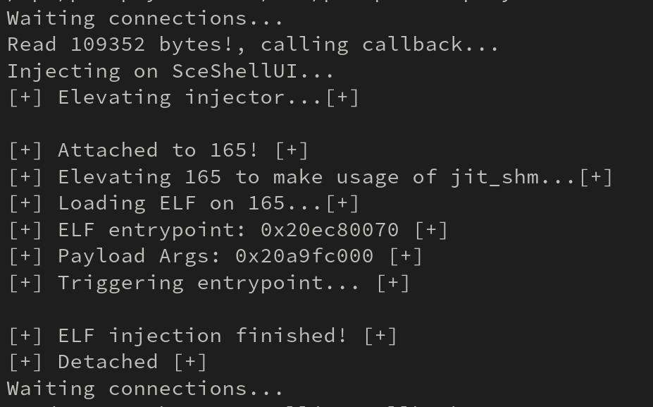

# YoRHa No.9 Type S -- 9S

9S is an ELF injector for the PS5 that utilizes the JIT memory space (which is executable) to manually map an ELF file. This method is necessary because allocating executable memory with functions like `mmap` is not possible.

## How this works

Using kernel R/W primitives, the injector elevates its own privileges to attach to remote processes via `ptrace`. This allows for the invocation of remote functions and syscalls in the target process. 

Since not every process supports JIT, the target process is also elevated before allocating JIT memory. Once the ELF is mapped, a remote thread is created within the target process that points to the ELF entry point.

## Building

To build the project, you will need [John Törnblom's SDK](https://github.com/ps5-payload-dev/sdk). After installation, simply edit the Makefile with the correct PS5 IP address:

Use a simple `make` to build the project:

> make

To send to the PS5 just hit:

> make test

## Using

The injector will run a TCP server on port `9033`. The protocol is simple; it waits for a process target name and an ELF file to be sent in the same packet. The process name is limited to 256 characters, so it must be 256 bytes plus the ELF file. You can use `send_injection_elf.py` to facilitate your work:

> python3 send_injection_elf.py SceShellUI hello_world.elf PS5_IP_ADDRESS

## Extra - Initial idea

The original concept for this project can be found in this [commit](https://github.com/buzzer-re/NineS/tree/24067bdb0103ad335293d5f0a9fbc09d59de005d), which involved using the `.text` section from libraries to map the ELF file. This approach did not work because we don't have permissions to mprotect executable areas, causing crashes when accessing writable variables. However, this remains a useful technique for injecting small shellcodes.

## Resources

- [Elfldr](https://github.com/ps5-payload-dev/elfldr)
- [John Törnblom amazing SDK](https://github.com/ps5-payload-dev/sdk)
- [PS5 gdb server project](https://github.com/ps5-payload-dev/gdbsrv)

